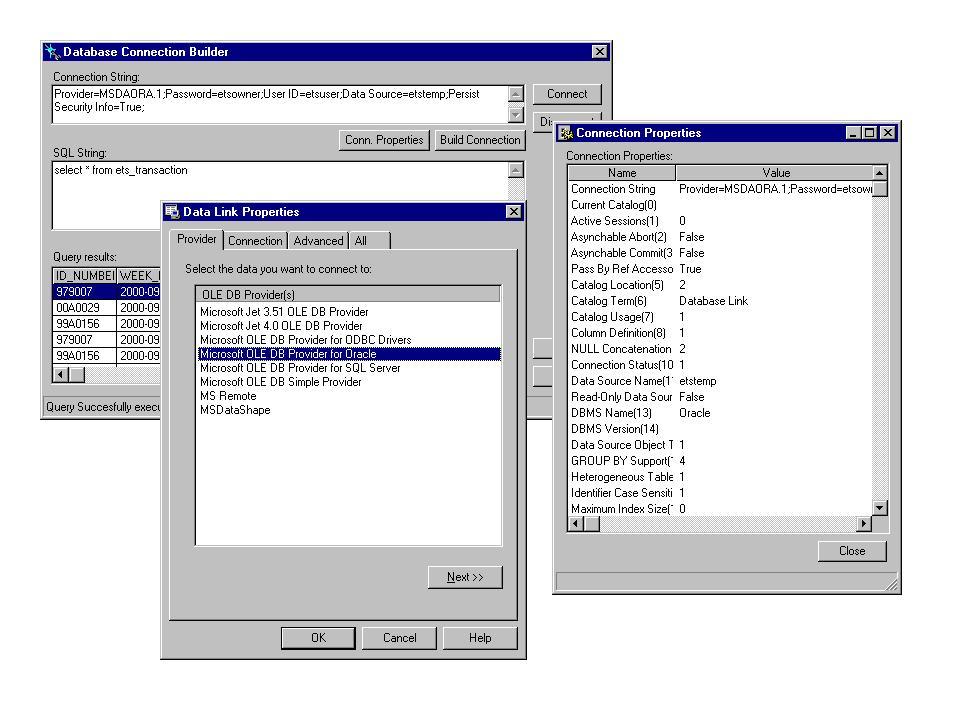



## ADO Connection Builder

### Description

This application discovers all about ADO Connection builder to help you Creating ADO Connection String to any databases or maybe use the codes to your project in simple way as 123....

Don't forget to vote me.....
 
### More Info
 
RZKCls.DLL

Compile RZKConnectionBuilder as a DLL and then Open project DBConnection. You will see how it works.

ConnectionString, ActiveConnection

             |
---                |---
**Submitted On**   |2001-02-03 10:59:16
**By**             |[Rizka Arifianto](https://github.com/Planet-Source-Code/PSCIndex/blob/master/ByAuthor/rizka-arifianto.md)
**Level**          |Intermediate
**User Rating**    |4.9 (69 globes from 14 users)
**Compatibility**  |VB 6\.0
**Category**       |[Databases/ Data Access/ DAO/ ADO](https://github.com/Planet-Source-Code/PSCIndex/blob/master/ByCategory/databases-data-access-dao-ado__1-6.md)
**World**          |[Visual Basic](https://github.com/Planet-Source-Code/PSCIndex/blob/master/ByWorld/visual-basic.md)
**Archive File**   |[CODE\_UPLOAD14459232001\.zip](https://github.com/Planet-Source-Code/rizka-arifianto-ado-connection-builder__1-14954/archive/master.zip)

